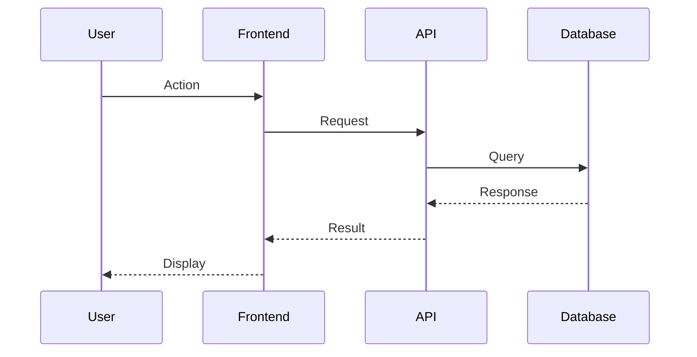

# EDD Planning Phase (Steps 11-13.75)

> Phase skill for `phase-planning` agent. For overview: `load skill edd-overview`.

## Delegation Pattern

### FULL Tier (Steps 11-13.75)

- Step 11: **Alchemist (Sonnet) MODE: plan** — transform discovery brief into service/schema plan
- Step 12: **Alchemist (Sonnet) MODE: plan** — create test strategy hierarchy
- Step 13: **Parallel dispatch** — @architect + @verify review simultaneously
- Steps 13.5-13.75: Phase orchestrator inline (user gates)

### FEATURE Tier (Step 5 — compressed)

All FULL planning compressed into one step:

- **Single alchemist pass**: service plan + test strategy + impact analysis combined
- **No separate AI team verify** (Step 13 skipped — rely on user gate only)
- **Impact + UX in one output** (Steps 13.5 + 13.75 merged)
- **User gate**: one approval for plan + impact + UX (not two separate gates)

**FEATURE Step 5 output must include:**
1. Implementation plan (which files, what changes)
2. Test hierarchy (E2E → Integration → Unit mapping)
3. Impact summary (services, APIs, DB — inline, not template)
4. UX flow preview (ASCII journey + smoke.md section)

## Step Overview

| Step      | Name                         | Description                                                                                | Output              |
| --------- | ---------------------------- | ------------------------------------------------------------------------------------------ | ------------------- |
| **11**    | Detailed Service/Schema Plan | For each test case: services_to_create, services_to_update with full interface definitions | Implementation plan |
| **12**    | Test Strategy                | Map E2E tests → Integration tests → Unit tests hierarchy                                   | Test plan           |
| **13**    | AI Team Verify               | Checkpoint: get AI consensus on technical plan                                             | Verification record |
| **13.5**  | Flow Impact Visualization    | Technical impact: services, APIs, database changes                                         | Impact analysis     |
| **13.75** | **UX Flow Validation Gate**  | User journey map, smoke.md preview, mental model check                                     | **User approval**   |

**GATE: Technical + UX Approval Required**

---

## Step 13.5: Flow Impact Visualization (MANDATORY)

**Purpose:** Developer sees the FULL PLAN before any implementation begins.

**MUST SHOW:**

1. **User Journey Diagram** (Mermaid sequence diagram)



2. **Services Affected Table**
   | Service | Action | Changes |
   |---------|--------|---------|
   | ServiceA | CREATE | method1(), method2() |
   | ServiceB | UPDATE | Add newField |

3. **API Changes**
   | Endpoint | Method | Request Schema | Response Schema |
   |----------|--------|----------------|-----------------|
   | /api/resource | POST | CreateRequest | CreateResponse |

4. **Database Migrations** (if any)
   - [ ] Add column X to table Y
   - [ ] Create new table Z

5. **E2E Tests Planned**
   - `test_user_can_do_action`
   - `test_user_cannot_do_invalid_action`

6. **Test Data Required**
   - `tests/fixtures/resource/valid.json`
   - `tests/fixtures/resource/invalid.json`

**Template:** Use `prompts/flow-impact-template.md`

**STOP POINT:**

```
---
**Approve this plan before RED phase? [Y/N]**
```

**ENFORCEMENT:** NEVER proceed to Step 13.75 without explicit user approval of the technical impact.

---

## Step 13.75: UX Flow Validation Gate

**Purpose:** Before RED phase, show user journey with smoke.md preview. User approves the UX.

**MANDATORY OUTPUT FORMAT:**

```markdown
## UX Flow Validation: EVO{N}.{M} - Flow Name

### User Journey Map

| #   | User Action      | Sees            | Interaction   | Result         |
| --- | ---------------- | --------------- | ------------- | -------------- |
| 1   | Opens app        | Landing page    | -             | -              |
| 2   | Clicks "Login"   | Login form      | Button click  | Form visible   |
| 3   | Types email      | Email in input  | Keyboard      | Value captured |
| 4   | Types password   | Dots (masked)   | Keyboard      | Value captured |
| 5   | Clicks "Sign In" | Loading spinner | Button click  | API call       |
| 6a  | (success)        | Dashboard       | Auto-redirect | Session active |
| 6b  | (failure)        | Error message   | -             | Form preserved |

### Journey Diagram (ASCII)

START
|
v
[Landing Page]
| click "Login"
v
[Login Form]
| enter credentials
| click "Sign In"
|
|--success--> [Dashboard] --> END
|
|--failure--> [Login Form + Error]
| retry
--> back to form

### smoke.md Section Preview

## EVO{N}.{M}: Flow Description

**Test:** User can perform action successfully
**Sub-EVO:** EVO{N}.{M}
**Scope:** ~80 lines

### Browser Steps

1. Navigate to http://localhost:3000
2. Click element with text "Action"
3. Wait for form visible
4. Fill in fields
5. Click submit
6. Wait for navigation
7. Verify: Expected text visible

### Expected Outcomes

- Session created
- Redirected to target
- User data displayed

### Mental Model Check

- "Action" button visible on landing
- Password masked while typing
- User might expect "Forgot password?" → Add to backlog

### State Transitions Verified

| Action         | Before     | After                       |
| -------------- | ---------- | --------------------------- |
| Submit valid   | No session | Session created             |
| Submit invalid | No session | Error shown, form preserved |

---

**Approve UX flow for implementation?** [Y/N]
```

**What This Gate Validates:**

1. **User journey is complete** - No dead ends
2. **smoke.md is ready** - Browser can execute this
3. **Mental model aligned** - User expectations met
4. **State transitions clear** - We know what changes
5. **Scope is granular** - ~50-100 lines max

**STOP POINT:** User must approve BOTH technical (13.5) AND UX (13.75) before RED phase.

---

## Planning Checklist

- [ ] Step 11: Detailed plan per test case
- [ ] Step 12: Test hierarchy mapped (E2E → Int → Unit)
- [ ] Step 13: AI verified
- [ ] Step 13.5: Technical impact shown (services, APIs, DB)
- [ ] **GATE:** User approves technical impact
- [ ] **Step 13.75:** UX journey map with table
- [ ] **Step 13.75:** smoke.md section preview
- [ ] **Step 13.75:** Mental model validated
- [ ] **GATE:** User approves UX flow
